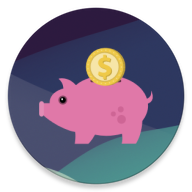

# FinBill
Yet another app to manage expenses.

There are already some applications available on Google Play Store that provide lots of features regarding expense management, but sometimes they are difficult to use, and/or you have to pay a subscription for them.
This project aims to propose a free and easy-to-use accounting application which tracks personal expenses dividing them by category, possibly recording recurrent ones (like subscriptions, bills, taxes…).
  
## Requirements

### High priority
- [x] As a user, I want to add a new movement
- [x] As a user, I want to visualize all my movements in one place
- [x] As a user, I want to visualize a list of all my expenses
- [x] As a user, I want to visualize a list of all my incomes
- [x] As a user, I want to visualize a list of all my transfers
- [x] As a user, I want to add a new account
- [x] As a user, I want to add a new category
- [x] As a user, I want to use more currencies in my accounts
- [ ] As a user, I want to see the balance of each account (It is recorded the initial balance, but it is not updated)
- [ ] As a user, I want to see the balance of each account in a currency of my choice (exchange rates are recorded but they are never queried, since the balance is not updated)

### Medium priority
- [x] As a user, I want to visualize a list of all my accounts
- [x] As a user, I want to visualize a list of all my categories
- [ ] As a user, I want to see the total of my movements (Not yet implemented)
- [ ] As a user, I want to see the total of expenses per category (It is recorded the initial value (0), but it is not updated)

### Low priority
- [x] As a user, I want to visualize a list of all my expense categories
- [x] As a user, I want to visualize a list of all my income categories
- [x] As a user, I want to add a recurrent movement
- [x] As a user, I want to add a picture from gallery to a movement
- [x] As a user, I want to add a picture from camera to a movement
- [x] As a user, I want to add a long-term movement
- [x] As a user, I want to choose the priority of a movement
- [x] As a user, I want the dark mode!!!
- [ ] As a user, I want that my application is in my language (Provided only English, Danish and Italian translations: there are all the required resources for providing also French and German, but they are simply copy-paste from English)
- [ ] As a user, I want to set my preferred currency for movements (You can do it in the initial setup, but you cannot change it later (Settings Fragment not configured yet))
- [ ] As a user, I want to be notified when a recurrent movement is due (There is the option, but the backend is not configured for this purpose)
- [ ] As a user, I want to visualize a list of all my recurrent movements (Not yet implemented)
- [ ] As a user, I want to backup and restore my database (Firebase is installed, but the login button does not work)
- [ ] As a user, I want to know an estimation of my expenses for the next month (Not yet implemented)

## App features - YouTube
https://youtu.be/TXCmN3UyaPk